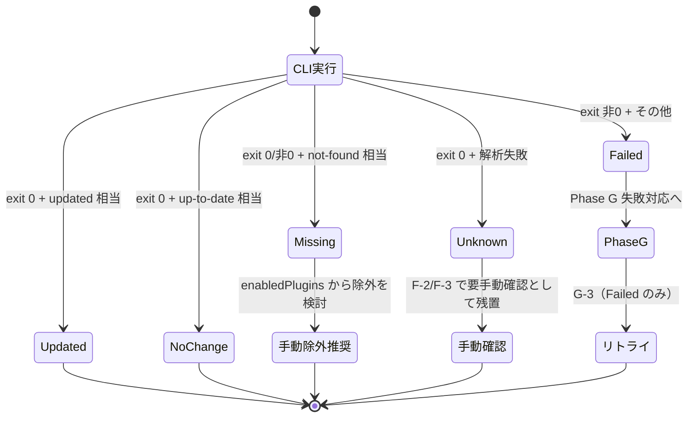

# Architecture Decision Records (plugins-update)

`plugins-update` プラグイン固有の設計判断記録。プラグイン横断の規約は親マーケットプレイス側
（`extension-toolkit/references/architecture-decisions.md`）を参照。

| 番号 | タイトル | 状態 |
|------|---------|------|
| ADR-PU-001 | 単一プラグイン化（vs marketplace-toolkit への統合 / vs スキル化） | Accepted |
| ADR-PU-002 | 公式 CLI 委譲（vs 低レベル git 操作 / vs 内部実装） | Accepted |
| ADR-PU-003 | Phase A-0〜G 固定順序 | Accepted |
| ADR-PU-004 | 横断ルール SSOT 配置（cross-cutting-rules.md への分離） | Accepted |
| ADR-PU-005 | exit code 一次判定 + Unknown 区分 | Accepted |
| ADR-PU-006 | サーキットブレーカー閾値と粒度 | Accepted |
| ADR-PU-007 | 失敗対応の対話モデル | Accepted |
| ADR-PU-008 | コマンドとスキルの責務分離（トリガー / 実作業） | Accepted |

---

## ADR-PU-001: 単一プラグイン化

### Context

プラグイン更新の手動トリガー機能を Claude Code 上で提供するにあたり、以下の配置選択肢があった。

1. **単一プラグイン化**: `plugins-update` として独立したプラグインとして提供
2. **`extension-toolkit:marketplace-toolkit` への統合**: マーケットプレイス本体管理スキルに更新機能を含める
3. **スキル化**: `extension-toolkit` 配下のスキルとして実装

### Decision

**選択肢 1（単一プラグイン化）** を採用する。

### Rationale

- **責務分離（SRP）**: 更新メンテナンスは「マーケットプレイス本体管理」「公開ワークフロー」と
  独立した運用関心事である。エンドユーザーが日常的に呼び出す手動メンテナンスコマンドであり、
  開発時のみ使う `marketplace-toolkit` / `marketplace-publisher` とライフサイクルが異なる。
- **配布単位の独立性**: `extension-toolkit` をインストールしないユーザーでも、本プラグイン単独で
  インストール・利用可能にすることで、配布範囲を最大化できる。
- **依存関係の最小化**: 他プラグインへの依存を持たず（`dependencies: []`）、Claude Code CLI のみを
  要件とすることでインストール障壁を下げる。詳細な CLI 委譲方針は ADR-PU-002 を参照。

### Trade-offs

- `marketplace-toolkit` との連携は README リンクに留まり、自動同期はしない。
- 機能追加時に `extension-toolkit` 側のテンプレート資産は流用できない。

### Alternatives Considered

- **`marketplace-toolkit` への統合**: 開発時スキルに運用コマンドを混在させると SRP 違反になり、
  `extension-toolkit` のサイズが肥大化する。却下。
- **スキル化**: スキルは AI が自動起動する単位だが、本機能は明示的なユーザートリガー
  （`/update-all`）が前提のため、スラッシュコマンドが適切。却下。

### Future Direction

他のメンテナンス系コマンド（例: `uninstall-all`、`prune-all` 等）が追加された場合、
本プラグインを `maintenance-toolkit` 等の包括プラグインに発展させる選択肢を残す。

#### 境界判断基準

- **エンドユーザ運用コマンド** → 本プラグイン or 後継 `maintenance-toolkit` の責務
- **プラグイン作者向け開発コマンド** → `extension-toolkit` の責務
- **マーケットプレイス管理コマンド** → `extension-toolkit:marketplace-toolkit` の責務
- **公開ワークフロー** → `extension-toolkit:marketplace-publisher` の責務

その判断時点で本 ADR の Decision を見直す。

---

## ADR-PU-002: 公式 CLI 委譲

### Context

ADR-PU-001 で単一プラグイン化を採用した前提のもと、マーケットプレイスとプラグインの更新を
実装するにあたり、以下の選択肢があった。

1. **公式 CLI 委譲**: `claude plugin marketplace update` / `claude plugin update <name>@<mp> --scope <scope>`
   を呼び出す
2. **低レベル git 操作**: 各マーケットプレイスのインストールディレクトリで `git fetch + reset --hard origin/HEAD`
   を直接実行する
3. **内部実装複製**: Claude Code CLI の更新ロジックを本プラグイン内に複製する

### Decision

**選択肢 1（公式 CLI 委譲）** を採用する。

### Rationale

- **破壊的操作の回避**: `git reset --hard` はローカルコミット・stash・detached HEAD・独自ブランチ等の
  ユーザ作業を意図せず破壊するリスクがある。CLI は内部でロック制御と状態管理を行い、これらを安全に
  扱う責務を負う。
- **シークレット非接触**: 本プラグインは Git credential helper / SSH キー / `.netrc` /
  `mcpServers` 内 API キーに **読み取りアクセスしない**。認証情報の取り扱い責務を CLI に委譲する。
- **CLI 機能改善の自動取り込み**: CLI バージョンアップで新機能（並列更新・JSON 出力等）が追加された場合、
  本プラグイン側の修正なしに恩恵を受けられる。
- **責務委譲によるシンプル化**: ロック・ロールバック・ネットワーク制御の責務を持たないため、
  本プラグインは「順序制御 + 結果集約 + ユーザ対話」に専念できる。

### Trade-offs

- **CLI 仕様変更への追従**: CLI 出力フォーマット変更時、結果分類ロジック（ADR-PU-005）が影響を受ける。
- **CLI 依存**: Claude Code CLI が PATH に存在しない環境では動作しない。
  Phase A-0 で事前チェック + 出力キーワード照合により早期失敗させる。
- **CLI 内部の挙動が不透明**: 並列処理・ロック粒度等が CLI 実装に依存する。
  本プラグイン側で全体タイムアウト（30 分・XR-2）を設定して暴走を防ぐ。
- **CLI バイナリ自体の真正性**: CLI バイナリが侵害されると本プラグインのセキュリティ前提が崩壊する。
  CLI 自体の真正性は OS のパッケージマネージャ署名検証に依拠する。検証コマンド例:
  - Linux (dpkg): `dpkg -V claude` 相当
  - macOS: `codesign -v $(which claude)`
  - Windows: `Get-AuthenticodeSignature (Get-Command claude).Source`
- **`marketplace update <name>` の個別 MP 指定が CLI で確認できない**: G-3 のリトライは現状
  全件リトライへフォールバックする（CLI が個別指定をサポートした際に挙動を更新する）。

### Alternatives Considered

- **低レベル git 操作（git fetch + reset --hard 直接呼び出し方式）**: security レビューで Critical
  （破壊操作の事前同意欠如）/ High（stash・detached HEAD 未対応）/ Medium（パストラバーサル）等の
  指摘多数。却下。
- **内部実装複製**: CLI のロジックを複製する保守コストが高く、CLI バージョン追従が困難。却下。

### Future Direction

CLI が `--output json` 等の構造化出力モードを提供したら、ADR-PU-005 を改訂し JSON 解析へ移行する。
外部 CLI 依存を `plugin.json` で機械可読に宣言する手段が公式仕様に追加された場合は速やかに対応する。
並列実行のサポートが CLI 側で提供された場合は ADR-PU-003 と組み合わせて検討する。
`marketplace update <name>` の個別 MP 指定が CLI で確認できた場合は G-3 のリトライ戦略を更新する。

---

## ADR-PU-003: Phase A-0〜G 固定順序

### Context

複数のマーケットプレイスと複数スコープのプラグインを更新する処理の **順序** をどう構造化するかを決定する。
（結果分類ロジックは ADR-PU-005、横断ルール配置は ADR-PU-004、対話モデルは ADR-PU-007 を参照）

### Decision

以下の **Phase A-0〜G の固定順序** で逐次処理する。

| Phase | 内容 | 実行順 |
|-------|------|-------|
| A-0-1 | 引数バリデーション（`--scope` 値のホワイトリスト照合） | 1（最優先） |
| A-0-2 | Claude Code CLI 存在チェック + 必要サブコマンド連続文字列照合 | 2 |
| A | 対象収集（`marketplace list` + `enabledPlugins` 抽出） | 3 |
| A-1 | プラグイン名・MP 名・スコープ名の入力検証（XR-1） | 4 |
| A-2 | マーケットプレイス整合性検証（`enabledPlugins` の MP が `marketplace list` に存在するか） | 5 |
| B | マーケットプレイス更新（`--scope` 指定でも常に実行） | 6 |
| C | User スコープのプラグイン更新 | 7 |
| D | Project スコープのプラグイン更新 | 8 |
| E | Local スコープのプラグイン更新 | 9 |
| F | 結果報告（サマリ + マーケットプレイス詳細 + スコープ別詳細） | 10 |
| G | 失敗対応の確認 + 限定リトライ + 再描画 | 11 |

### Phase 番号体系

- **基本 Phase**: A / B / C / D / E / F / G の 1 文字。
- **派生 Phase**（Phase 全体の前後に追加するもの）: `A-0` / `A-1` / `A-2` のようにハイフン枝番。
- **サブフェーズ**（Phase 内のステップ）: `B-1` / `C-1` / `F-0` / `F-1` のようにハイフン枝番。
- **混在の解決**: 派生 Phase は当該基本 Phase に **論理的に属する処理ステップ** であり、
  サブフェーズは「結果分類」「サマリ表示」等のステップ。番号衝突を避けるため、新規追加の際は
  本 ADR を更新して位置付けを明記する。
- **A-2 の単一実施**: A-2 は Phase A 直後に 1 回のみ実施する。Phase B 後の再実施は行わない
  （仕様簡素化のため）。

### Rationale

- **A-0 を最優先実行する理由**: CLI 不在時に Phase A 以降が無意味な失敗を量産する前に早期エラー終了。
- **MP → User → Project → Local** の固定順は、(a) マーケットプレイス本体が SSOT のため最新化を
  プラグイン更新より先に行う必要があり、(b) スコープは上書き優先順位（より狭いスコープが優先）の
  逆順で更新することで「広いスコープから順に最新化される」ためユーザの認知モデルに合致する。
- **Phase B を `--scope` 指定でも常に実行** する理由: マーケットプレイスは全プラグインの SSOT であり、
  スコープ限定更新でも最新の MP インデックスが必要なため。
- **冪等性**: 同一 (plugin, marketplace) を複数スコープで処理しても CLI 側で冪等性が保証される
  （`enabledPlugins` がスコープごとに独立 SSOT であるため）。

### Trade-offs

- **直列処理**: 並列実行による I/O 待ち短縮の余地を放棄。CLI のロック競合リスクを避けるため
  当面は直列を維持。将来的に `update-one(scope, plugin, marketplace) → result` 抽象を導入し、
  Strategy パターンで並列化への切り替え可能にすることを検討。
- **A-2 の単一実施によるドリフト**: Phase A 直後に 1 回のみ実施するため、Phase B（マーケットプレイス更新）で
  新規 MP が追加された場合、当該 MP 配下の `enabledPlugins` エントリは Skipped（マーケットプレイス未登録）
  扱いのまま当該セッション内では更新されない（次回実行で初回更新される）。Phase F に該当する INFO を
  表示してユーザの認知ギャップを埋める。
- **Strategy 抽象化の現状**: Phase C / D / E は scope パラメータ違いの同一ロジックであり、論理的には
  `update-scope(scope)` の 3 回適用。将来 `update-one(scope, plugin, marketplace) → result` 抽象を
  導入する素地として記述上も対称化している。

### Alternatives Considered

- **並列実行**: CLI の内部ロック挙動が公式に保証されていないため、現時点では却下。
- **スコープ → MP の順序**: ユーザの認知モデル（プラグインが先・MP は背後）に反するため却下。
- **A-2 の Phase B 後再実施**: 仕様複雑化に対して効果が小さい（B でマーケットプレイスが新規追加される
  ケースは現実的に稀）。次回実行時に反映されれば即時性は不要。却下。

### Future Direction

CLI が並列実行を公式サポートしたら、Phase C/D/E を `update-one` 抽象化して並列戦略に切り替える。
ADR-PU-002 の Future Direction と連動する。

---

## ADR-PU-004: 横断ルール SSOT 配置

### Context

入力検証・タイムアウト・出力サニタイズ・リトライ上限・Unknown 警告の 5 つは複数 Phase に横断適用される
「横断関心事（cross-cutting concerns）」。これをどこで定義するかを決定する。

### Decision

横断ルール XR-1〜XR-5 を `references/cross-cutting-rules.md` に切り出して **SSOT** とする。
コマンド本文 `commands/update-all.md` は本ファイルへの参照のみを持ち、規則本体を再定義しない。

### Rationale

- **Clean Architecture 階層分離**: 横断関心事を Implementation 層（コマンド本文）から Policy 層
  （references/）に持ち上げることで、層間依存方向を整理する。
- **将来の `update-one` 抽象化への耐性**: 別コマンドが追加された場合、`cross-cutting-rules.md` を
  共通参照することでコピペ重複を回避できる。
- **設計根拠の明示**: 各 XR の数値（60 秒・30 分・40 字・1 回・20% 等）の根拠を本ファイルに集約することで、
  将来の値変更判断が容易になる。

### Trade-offs

- **参照のオーバーヘッド**: コマンド本文を読む際に `cross-cutting-rules.md` への参照を追わないと
  詳細が分からない。
- **2 ファイル同期義務**: 規則変更時に 2 ファイルが整合する必要があるが、実体は SSOT 側にあり
  コマンド本文は「適用範囲のみ」を示すため、同期コストは小さい。

### Alternatives Considered

- **コマンド本文に SSOT を置く方式**: `update-one` 等の追加コマンド時に重複が発生するため、
  SRP / DRY 違反のリスクが高い。却下。
- **ADR 内に直接記載**: ADR は「決定根拠」を記録するもので、運用ルール本体ではない。
  `cross-cutting-rules.md` のような専用ファイルが適切。却下。

### Future Direction

#### XR 番号体系の拡張ルール

- **追加**: 新規横断関心事は `XR-{次番号}` で採番。`cross-cutting-rules.md` の冒頭表と本文・関連 ADR に
  追加する。コマンド本文の参照表も同期更新する。
- **削除**: 不要になった XR は **削除せず**「Deprecated」状態として残し、別 XR への統合や置換先を
  本文末尾に明記する。番号の再利用は禁止。
- **統合**: 複数の XR を統合する場合、新規番号を割り当て、旧 XR は Deprecated とする。
- **他プラグインからの参照**: 本ファイルは plugins-update 専用。他プラグインから直接参照させない。
  共通化が必要なら `extension-toolkit/references/` 側に同等ファイルを用意する。

---

## ADR-PU-005: exit code 一次判定 + Unknown 区分

### Context

公式 CLI の成否をどう判定し、想定外の出力をどう扱うかを決定する。
本 ADR は **マーケットプレイス更新（B-1）** と **プラグイン更新（C-1 / D-1 / E-1）** の両方に適用する。

### Decision

CLI の成否は **exit code を一次判定** とし、出力テキストの解析は補助情報に降格する。
判定不能ケースは "Unknown（要手動確認）" 区分として残す。

#### 結果分類テーブル — プラグイン更新（C-1 / D-1 / E-1 共通）

| exit code + 出力 | 結果分類 |
|------------------|---------|
| exit 0 + `updated` 相当 | Updated |
| exit 0 + `up-to-date` / `already latest` 相当 | No change |
| exit 0 + `not found` / `no such plugin` 相当 | Missing |
| exit 非 0 + `not found` / `no such plugin` 相当 | Missing |
| exit 非 0 + 上記以外 | Failed |
| exit 0 + いずれの相当文字列も検出不能 | Unknown |

#### 結果分類テーブル — マーケットプレイス更新（B-1）

| exit code + 出力 | 結果分類 | 後続処理 |
|------------------|---------|---------|
| exit 0 + 出力に `Failed:` / `Error:` 行なし | OK | Phase C 以降を通常実行 |
| exit 0 + 出力に `Failed:` / `Error:` 行あり | 部分失敗 | 抽出 MP 名は Failed として記録、他 MP は OK。Phase C 以降を **警告付き継続** |
| exit 0 + 出力解析で MP 名抽出不能 | Unknown | F-2 に Unknown 区分で残し、当該 MP 配下のプラグインは Skipped（MP Unknown）として Phase C/D/E から除外 |
| exit 非 0 | 全体失敗 | Phase C 以降は **警告付き継続**（CLI が古いインデックスでプラグイン更新を試みる可能性のため停止しない） |

#### 例外行抽出パターン

`Failed:` / `Error:` 行抽出には以下の正規表現を使用する（XR-3 サニタイズを抽出後に必ず適用）:

```text
^(Failed|Error)[:\s]+(.+?)(?:\s+at\s|\s+in\s|$)
```

##### 想定される CLI 出力例（v1 系挙動）

```text
Failed: dmajima-claude-plugins
Error: my-private-mp at 14:35:00
Failed: another-mp in branch main
```

- 上記いずれの行も `^(Failed|Error)[:\s]+(.+?)(?:\s+at\s|\s+in\s|$)` のキャプチャグループ 2 で
  MP 名（`dmajima-claude-plugins` / `my-private-mp` / `another-mp`）が取得される。
- `at <時刻>` / `in <branch>` のような後続フィールドが付かない場合は行末（`$`）でキャプチャ終端する。
- CLI バージョンによっては `Failed: <mp-name>: <error-detail>` のように追加コロン区切りが入る場合があり、
  その場合キャプチャ 2 は `<mp-name>: <error-detail>` を含む可能性がある。**XR-1 の正規表現
  （`^[A-Za-z0-9]([A-Za-z0-9_.-]{0,62}[A-Za-z0-9])?$`）で再照合** することで、コロン区切りを含む
  値は不一致となり Unknown 扱いに振り分けられる（誤判定の安全弁）。

抽出した MP 名候補は XR-1 の正規表現に再照合し、合致しないものは Unknown として扱う。

#### Unknown 件数の警告閾値

XR-5 を参照（試行済み件数の 20% 超で警告）。

### Rationale

- CLI の出力フォーマットはバージョン間で変わりうるため、出力テキストの正規表現マッチに依存すると
  CLI バージョン変更時に静かに誤分類が発生する。
- exit code は POSIX 慣習として安定したインターフェースであり、CLI バージョン非依存性が高い。
- 出力解析が失敗した場合に "Unknown" 区分として残すことで、ユーザに「要手動確認」のシグナルを
  届けられる（誤った成功・失敗判定よりも安全）。

### Trade-offs

- **Unknown 区分の負担**: ユーザが Unknown エントリを手動確認する必要がある。XR-5 の 20% 警告閾値で
  異常検知の補助とする。
- **exit 0 + not-found ケース**: CLI が認証エラーを exit 0 で返す実装が稀に存在するため、
  出力解析の補助が完全には不要にならない。

### Alternatives Considered

- **キーワードマッチ一次判定**: 出力解析を一次にすると CLI バージョン変更時の壊れ方が静かで
  気付きにくい。却下。
- **失敗とみなす（Unknown を Failed に統合）**: 誤った Failed 判定が増え、Phase G の質問が
  ノイズで埋まる。却下。
- **B と C/D/E で分類テーブルを別 ADR に分離**: 共通ポリシー（exit code 一次判定）が同一であり、
  分類項目のみ異なるため、本 ADR に両方を記載するのが SSOT として妥当。却下。

### Future Direction

CLI が `--output json` 等の構造化出力モードを提供したら、本 ADR を改訂し JSON 解析に移行する。
拡張ポイント（Phase B-1 / C-1 / D-1 / E-1 の結果分類ロジック）は
[`phase-flow.md`](phase-flow.md) の該当 Phase セクションに明記してある（ADR-PU-008 でコマンド本文から
スキル references 配下に移管済み）。

#### Unknown / Missing 区分の状態遷移（補足）

Missing は CLI リトライしても回復しない（マーケットプレイスから消失）ため、Phase G の
リトライ対象から **除外**し、ユーザに「`enabledPlugins` 除外を検討」を促す（Phase F-4 のアクション）。



---

## ADR-PU-006: サーキットブレーカー閾値と粒度

### Context

XR-2 のサーキットブレーカー（同一 MP に対する累計失敗で配下を Skip）について、閾値・粒度・カウント方式を決定する。

### Decision

- **粒度**: マーケットプレイス（MP）単位。
- **閾値**: 同一 MP に対する **累計 3 件以上の Failed**。
- **カウント方式**: 連続・非連続を問わない累計（フェーズ横断で B / C / D / E すべての Failed を集計）。
- **作動時挙動**: 当該 MP 配下のプラグイン更新エントリ（残）を Skipped（サーキットブレーカー作動）として除外。
  G-3 のリトライ対象からも除外。

### Rationale

- **MP 単位**: 失敗の根本原因（ネットワーク・認証・MP 自体の障害）は MP に紐づくことが多く、
  同一 MP の他プラグインも同じ理由で失敗する可能性が高い。プラグイン単位での個別判定は
  オーバーヘッドが大きく、無駄なリトライを生む。
- **累計 3 件**: 経験的閾値。1〜2 件は一過性のネットワーク失敗の可能性、4 件以上は反応が遅い。
  「3 件 = 統計的にパターン化された失敗」と判断する妥協点。
- **連続判定方式 vs 累計判定方式**: 連続判定方式では非連続パターン（2 件失敗→1 件成功→2 件失敗）を
  検知できない。本 ADR では累計判定方式を採用する。

### Trade-offs

- **誤作動の可能性**: 同一 MP の 3 プラグインがたまたま個別事情で失敗した場合（authentication 切れ等）、
  4 件目以降の正常更新がスキップされる。ユーザは Phase G で全件リトライを選択することで再実行可能。
- **大規模 MP での影響**: 100 件のプラグインを持つ MP で 3 件失敗すると残 97 件がスキップされる。
  ただしリトライ機構（XR-4）でリカバー可能。
- **敵対的 DoS の影響範囲**: MP 提供者が悪意ある場合、配下 3 プラグインを意図的に失敗させて 4 件目
  以降の正規プラグイン更新をスキップさせる DoS が理論的に可能。ただし以下により影響は限定的:
  (1) 既存インストール済みプラグインはそのまま動作するため可用性影響は更新の遅延のみ、
  (2) ユーザは Phase G で「全件リトライ」を選択することで再実行可能、
  (3) 影響範囲は当該 MP 配下のみで他 MP には波及しない、
  (4) 公式 CLI 委譲（ADR-PU-002）により認証情報・データ毀損には繋がらない。
  MP 提供者の信頼性確認は別レイヤ（マーケットプレイス追加時のユーザー同意）で担保する。

### Alternatives Considered

- **連続失敗のみカウント**: v2.1.0 方式。非連続失敗パターンを見逃す。却下。
- **失敗率（5 件中 3 件）**: 母数が少ない場合に判定が不安定。却下。
- **指数バックオフ**: ローカル CLI 委譲のため過剰。却下。
- **プラグイン単位**: オーバーヘッド大、根本原因が MP に紐づくため意味薄。却下。

### Future Direction

CLI が並列実行をサポートした際は、サーキットブレーカーの集計が並列セッション間で正しく行われるか
の再評価が必要。現状は逐次実行のため単純カウンタで十分。

---

## ADR-PU-007: 失敗対応の対話モデル

### Context

Phase G での失敗対応をどのような対話形式で実施するかを決定する。
特に「失敗の性質（リトライで回復するか）」と「失敗件数の多寡」を考慮する必要がある。

### Decision

- **失敗総数 N の定義**: **Failed のみ**（Missing は CLI リトライで回復しないため対象外、
  Unknown は要手動確認のため対象外）。
- **G-1（全体方針）**: Failed エントリに対し「全件リトライ / 個別に判断 / 全件スキップ」の 3 択を 1 回提示。
- **G-2（個別判断）**: G-1 で「個別に判断」を選択した場合のみ、Failed エントリ数 N が **5 件以下**
  のときに各エントリ個別に「リトライ / スキップ」を質問。
- **件数閾値 5 件超**: G-1 の選択肢から「個別に判断」を **動的に除外**（連続質問による UX 劣化防止）。
- **質問テキスト切り詰め**: G-2 の質問テキストはサニタイズ後 500 字を上限に切り詰める
  （マスクトークン `***...***` の途中で切らない）。
- **Missing の扱い**: Phase G の対象としない。Phase F-4「次のアクション」で
  「`enabledPlugins` から除外することを検討」とユーザに提示する（リトライではなく設定変更を促す）。

### G-1 質問文の `<M>` / `<P>` 内訳

質問文 `<N> 件の更新失敗（マーケットプレイス: <M> 件 / プラグイン: <P> 件）` の定義:

- `<M>`: マーケットプレイス更新（Phase B-1）で Failed と判定された件数。CLI が MP 単位の Missing を
  返さないため B-1 の Missing は存在しない。
- `<P>`: プラグイン更新（Phase C/D/E）で Failed と判定された件数（Missing は除外）。
- `<N> = <M> + <P>`。

### Rationale

- **Missing をリトライ対象から除外**: Missing は CLI が「プラグインがマーケットプレイスから消失した」と
  判断した状態であり、CLI を再実行しても結果は変わらない（むしろユーザは `enabledPlugins` を整理する
  必要がある）。Failed（ネットワーク・認証・一時的障害）と Missing（永続的不在）は対応アクションが
  異なるため、リトライの対象を Failed に限定するのが SRP に整合。
- **5 件以下**: 1 件あたり 5〜10 秒の認知負荷を想定し、5 件 × 10 秒 = 50 秒程度を許容上限とする経験則。
- **6 件以上**: 個別判断はユーザの集中力を消耗し、結局「全件リトライ」が選ばれる傾向が強い。
  最初から G-1 で完結させる方が UX が良い。
- **500 字切り詰め**: AskUserQuestion の表示上の可読性と、サニタイズ済みエラーメッセージの情報量の
  バランス点。

### Trade-offs

- **5 件超で個別判断不可**: 大量失敗時に「3 件は致命的だが残 5 件はネットワーク一過性」のような
  ニュアンスを表現できない。ユーザは「全件リトライ」→ 残った失敗を手動対応の流れになる。
- **Missing の対応がチャット内で完結しない**: ユーザが手動で `enabledPlugins` を編集する必要が
  ある。`/plugin uninstall` 等の CLI を別途実行する必要があるが、これは設計上の妥当な責務分離
  （本コマンドは「更新実行」が責務、設定編集は本コマンドの範囲外）。

### Alternatives Considered

- **Missing もリトライ対象に含める方式**: ユーザに無駄な「リトライしたが Failed のまま」体験を
  与える。却下。
- **常に個別判断可能**: 大量失敗時の UX が破綻。却下。
- **multiSelect で一括選択**: チェックボックス UI が AskUserQuestion で複雑化。却下。
- **件数閾値を 10 件にする**: 認知負荷上限を超える。却下。

### Future Direction

将来的に AskUserQuestion がテーブル形式の選択 UI を提供したら、件数上限を緩和できる可能性がある。
Missing の自動除外（`enabledPlugins` から削除する別フェーズ）を本プラグインに追加するかは
ユーザの設定変更権限の観点で要検討（現状はユーザ手動対応に委ねる）。

---

## ADR-PU-008: コマンドとスキルの責務分離（トリガー / 実作業）

### Context

ADR-PU-001 では「スキル化を却下」と判断した（理由: スキルは AI が自動起動する単位だが、本機能は
明示的なユーザートリガー前提のため）。しかし継続的なレビューで以下の構造的問題が浮上した:

- コマンド本文が肥大化（460 行超）し、Phase 詳細・横断ルール参照・サニタイズ規則・ユーザ対話が
  一つのファイルに集約されている
- サブフェーズ番号体系（A-0-1 / B-1 / F-0）の混在で命名整合性が保てない
- F-0 を独立サブフェーズから NOTE に再構成した結果、当初は cross-cutting-rules.md の
  `F-0 サニタイズ規則本体` という参照が宙吊りになる **歴史的経緯がある**（現行版では Phase 番号を持たない
  `### サニタイズ規則本体` に改称済みで本問題は解消済み。本記述は ADR の経緯記録としてのみ残す）等、
  SSOT 階層の整合性が脆弱化していた
- Phase 詳細を AI が読み解く際の認知負荷が高い

ADR-PU-001 のスキル化却下は「AI 自動起動 vs 明示的トリガー」の文脈で行われたが、本 ADR-PU-008 は
「コマンド = ユーザートリガー / スキル = 実作業の SSOT」という別の責務分離軸での判断。
両者は矛盾しない（ADR-PU-001 は配布単位の判断、ADR-PU-008 はプラグイン内の実装責務分離）。

### Decision

`/update-all` コマンドは **トリガーと引数解釈のみ** を担当し、実作業（Phase A-0〜G、横断ルール適用、
ユーザ対話）は **`plugin-updater` スキルに委譲** する。

- `commands/update-all.md`: 約 46 行（フロントマター + 関連リンク含む）/ 実装ロジックは約 30 行。
  引数解釈 + Skill ツール呼び出しのみ。
- `skills/plugin-updater/SKILL.md`: スキル概要 + Phase 全体像 + references への参照。
- `skills/plugin-updater/references/`:
  - `phase-flow.md`: Phase A-0〜G 詳細手順（コマンド本文から分離）
  - `output-formats.md`: Phase F のテーブル / 警告 / 質問文フォーマット集約
  - `cross-cutting-rules.md`: XR-1〜XR-5 SSOT（移管）
  - `architecture-decisions.md`: ADR-PU-001〜008 SSOT（移管）

### Rationale

- **責務分離（SRP）**: コマンドは「ユーザー入力の解釈」、スキルは「Phase の実行」と責務を直交化
- **SSOT 階層の純化**: Phase 詳細・サニタイズ規則・ADR が同一スキル配下に集約され、
  `F-0` のような Phase 番号と SSOT 名称の混乱が構造的に排除される
- **AI 解釈容易性**: スキルは AI が起動時に読み込む単位として設計されており、Phase 詳細を持つのに
  自然な配置
- **将来拡張への耐性**: 追加コマンド（例: `update-one`、`prune-all`）が同じスキルを共有可能
- **コマンド本文の単純化**: 約 460 行 → 約 46 行（実装ロジックは約 30 行）で、レビューでの
  「肥大化指摘」が構造的に解消

### Trade-offs

- **ファイル数増**: 4 ファイル → 7 ファイル
- **インストール容量増**: わずかに増加（数 KB 程度）
- **コマンドとスキルで `description` の重複管理**: 軽微だが SSOT 違反の懸念あり。
  当面の運用緩和策として、スキル側 SKILL.md「トリガー条件」セクションに「コマンド呼び出し経由のみ
  （AI 自動起動非対象）」を明示することで、AI が誤って自動起動する可能性を抑制している（SKILL.md
  「トリガー条件」節を参照）
- **スキル化により AI トリガー判定対象になる**: ただし `description` がスキル経由で起動される
  ことを示す内容のため、自動起動による意図しない動作のリスクは小さい

### Alternatives Considered

- **コマンド本文に Phase 詳細を維持**: 旧 v2.x までの方式。レビューで継続的に「肥大化」指摘を
  受けた。却下。
- **スキルだけで配布（コマンドなし）**: `/update-all` の明示的トリガーが失われ、
  ADR-PU-001 で却下した理由と同じ問題が再発。却下。
- **Phase 詳細を `commands/` 配下のサブファイル（例: `commands/update-all-phases.md`）に分割**:
  Claude Code の規約上、`commands/` 配下は単一スラッシュコマンドファイルが基本で、
  サブファイル参照の慣行が確立していない。却下。

### Future Direction

- 追加メンテナンスコマンド（`uninstall-all` / `prune-all` 等）が登場した場合、`plugin-updater`
  スキルから `update-one(scope, plugin, marketplace)` 抽象を切り出して共有する（ADR-PU-002 /
  ADR-PU-003 Future Direction と連動）
- スキル `description` がコマンドと重複する問題は、スキル側を「実作業の説明」に特化することで
  軽減を継続検討
