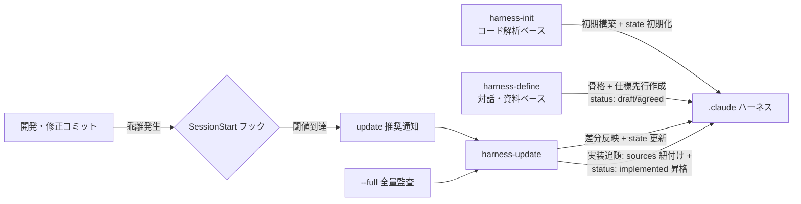

# 同期仕様（SSOT）

開発・修正で生じた変更を `.claude` ハーネスへ随時反映するための状態管理・差分検出・鮮度検知の仕様。
`harness-init` / `harness-define`（初期構築）・`harness-update`（差分反映）・SessionStart フック（鮮度検知）はこの仕様に従う。
ハーネスの構成定義は [structure-spec.md](structure-spec.md)、ドキュメントの書き方・検証は [authoring-spec.md](authoring-spec.md) が保有する。

## 1. .sync-state.json

配置: `<target-repo>/.claude/references/.sync-state.json`（git 管理対象。チームで同期状態を共有する）

```json
{
  "harness_spec_version": "1.2",
  "last_synced_commit": "<full-sha>",
  "last_synced_at": "<ISO 8601>",
  "initialized_at": "<ISO 8601>",
  "threshold_commits": 10
}
```

`harness_spec_version` の例示値は [structure-spec.md](structure-spec.md) 節 9 の現行版と一致させる（構成仕様の改定時は本例も更新する。[structure-spec.md](structure-spec.md) 節 9.1）。

| フィールド | 内容 |
|-----------|------|
| `harness_spec_version` | このハーネスが準拠する [structure-spec.md](structure-spec.md) の版（節 9）。構成仕様の改定時に既存ハーネスを追随させる判定に使う。初期構築時に設定し、`harness-update` の版数追随（節 5）と `harness-define` のドキュメント追加モード（下位版ハーネスへの任意要素導入時）でも更新されうる |
| `last_synced_commit` | 最後にハーネスへ反映済みのコミット SHA（full）。初期構築（`harness-init` / `harness-define`）完了時と `harness-update` 完了時に HEAD で更新 |
| `last_synced_at` | 最終同期日時 |
| `initialized_at` | 初期構築（`harness-init` / `harness-define`）の実行日時（初期化以降変更しない） |
| `threshold_commits` | 鮮度検知フックが update 推奨を通知する乖離コミット数の閾値（既定 10。spec-first 運用では `harness-define` が大きめの初期値 30 を設定する — 仕様のみのフェーズでは `.claude/` 配下のコミットが乖離としてカウントされ、update しても反映対象がない空振り通知になりやすいため）。**1 以上 9 桁以内の整数のみ有効**（範囲外・不正値は 10 として扱う）。通知を止めたい場合は十分大きい値（例: `100000`）を設定する |

### ハーネス実体あり・state 不在の状態

spec-first 運用でコミット 0 件のまま構築され、初回コミットが見送られた場合、`.claude/references/` の実体はあるが `.sync-state.json` が存在しない状態が生じうる。この状態では鮮度検知フック（節 3）は無干渉となり、放置すると同期の起点が確立されないまま監視が停止し続ける。復旧経路は 2 つ: (a) `harness-define` の再実行（部分的既存として検出され、初回コミットの承認ゲートを経て state が初期化される。コミット 0 件のままでも実行できる）、(b) コミットが 1 件以上ある場合の `harness-update` 実行（Phase 1 が本状態を検出し、HEAD での state 初期化 + 全量監査を提案する。コミット 0 件では HEAD が無く成立しないため (a) を使う）。

### ブランチ間のコンフリクト

`.sync-state.json` は git 管理対象のため、並行ブランチで `last_synced_commit` が競合しうる。差分検出は 2 点間のツリー比較（`<sha>..HEAD`）で行うため、**どちらの値を採用しても変更の取りこぼしは発生しない**（古い方を残せば再検出され、新しい方を残しても他ブランチの変更はツリー差分として検出される）。迷う場合は古い方（先祖側）を採用する。

## 2. 差分検出フロー（harness-update）

1. `.sync-state.json` から `last_synced_commit` を読む
2. `git diff --name-status -M <last_synced_commit>..HEAD` で変更ファイル一覧（A/M/D/R）を取得する（`-M` を明示し、利用者の `diff.renames` 設定に依存せず rename を検出する）
3. `references/` 配下全ドキュメントの frontmatter `sources` を収集する（グロブ記法は [structure-spec.md](structure-spec.md) 節 5.1）
4. 変更ファイルと `sources` を照合し、分類ごとに反映する:

| 分類 | 条件 | 動作 |
|------|------|------|
| 既存ドキュメント更新 | 変更ファイル（A/M）が既存ドキュメントの `sources` にマッチ | 該当ドキュメントの記載と実装の乖離を確認し更新する |
| ソース移動（R） | rename の **旧パス** が既存ドキュメントの `sources` にマッチ | 当該ドキュメントの `sources` を新パスへ書き換える。記載内容は原則据え置き（内容差分もあれば「更新」を併発させる）。整理候補として扱わない |
| 新規ドキュメント候補 | どの `sources` にもマッチしない追加ファイル群（まとまった機能単位） | **提案の前に実装追随の照合（節 2.1）を行う**。未実装の仕様ドキュメント（`status: draft` / `agreed`）との対応が推定される場合は当該ドキュメントへの紐付けを優先し、対応がなければ新規 spec / system-design / flow 等の作成を提案する。1 ファイル追加ごとに 1 ドキュメントを乱造せず、既存ドキュメントの `sources` 拡張で足りる場合はそちらを優先する |
| ドキュメント整理候補 | `sources` の対象ソースが全削除された（**rename による消失を除く**） | 該当ドキュメントの削除・アーカイブ・保持をユーザに確認する（実施方法は [structure-spec.md](structure-spec.md) 節 6.1。無確認削除禁止） |
| ハーネス直接編集 | 変更ファイルが `.claude/` 配下 | 反映不要（索引整合のみ確認する） |

5. 影響を受けた各フォルダの `CLAUDE.md` インデックスをファイル実体と一致させる（[authoring-spec.md](authoring-spec.md) 節 5）
6. 更新したドキュメントの frontmatter `updated` を更新する
7. `.sync-state.json` の `last_synced_commit` / `last_synced_at` を HEAD で更新する

### 2.1 実装追随（spec-first で作成した仕様への実装の紐付け）

`harness-define` で実装より先に作成した仕様ドキュメント（`status: draft` / `agreed`。[structure-spec.md](structure-spec.md) 節 5.2）に、後から始まった実装を紐付けて通常の同期サイクルへ合流させる手順。「新規ドキュメント候補」の**処理前フィルタ**として実行する（分類表の 5 分類は増やさない）。

| 手順 | 内容 |
|------|------|
| 1. 対象抽出 | `references/` 配下から `status: draft` / `agreed` のドキュメントを抽出する（`status` **明示**が条件。不在 = `implemented` は対象外。これにより用語集・ADR 等の `sources: []` ドキュメントは照合対象にならない） |
| 2. 対応照合 | どの `sources` にもマッチしない追加ファイル群と、抽出した未実装ドキュメントの対応を照合する。一次シグナルはパス・命名の類似性（機能名・画面名とディレクトリ / ファイル名の一致）、二次シグナルは実装内容と仕様記載の一致 |
| 3. 一意性判定 | 対応が **一意に推定できる** 場合のみ実装追随候補とする。複数候補があり絞り込めない場合は候補一覧をユーザに提示して選択させ、それも困難なら実装追随として扱わず通常の新規ドキュメント候補へフォールバックする |
| 4. 反映提案 | 実装追随候補として「`sources` へ実装パスを設定 + 記載と実装の突合結果 + `status: implemented` への昇格」を提案する |
| 5. 承認 | **ユーザ承認を必須とする**（対話モードのみ実施。非対話モードでは提案の報告のみ）。誤った `sources` 設定は以後の差分検出を恒久的に歪めるため、整理候補と同等の慎重さで扱う |

| 規則 | 内容 |
|------|------|
| 乖離は報告のみ | 記載と実装の突合で乖離（仕様と異なる実装）を検出した場合、**報告に留める**。ドキュメントを実装に合わせて書き換えるか・実装を仕様に合わせて修正するかはユーザ判断（反映方向の一方向原則（節 6）は維持し、仕様適合性の裁定には踏み込まない） |
| 昇格の条件 | `status: implemented` への昇格は、乖離が解消（またはユーザが乖離を許容してドキュメント側を更新）した後に行う |
| 部分実装 | 実装が段階的に進む場合、確認できた分のみ `sources` を部分設定し `status: agreed` のまま残してよい。部分設定済みの `sources` にマッチする変更は通常の「既存ドキュメント更新」が先に処理し、マッチしない追加ファイル群のみが本節の照合に回る |

### 未コミット変更の扱い

`git status` で未コミット変更を検出した場合、反映対象には含めず「未コミット変更が N 件あるため、コミット後に再実行すると反映される」旨を報告する（同期基準はコミット SHA のため、作業途中の状態を state に記録できない）。

## 3. 鮮度検知フック（SessionStart）

スクリプト: `${CLAUDE_PLUGIN_ROOT}/references/scripts/hooks/freshness_check.sh`
登録: `hooks/hooks.json`（matcher `startup|resume`、timeout 15 秒）

| ステップ | 動作 | 失敗時 |
|---------|------|-------|
| 1 | `CLAUDE_PROJECT_DIR`（未設定時は cwd）を基準にリポジトリルートを解決する | 無出力終了 |
| 2 | `.claude/references/.sync-state.json` の存在を確認する | 無出力終了（ハーネス未導入プロジェクトへは無干渉） |
| 3 | state から `last_synced_commit` / `threshold_commits` を読む（jq 優先・sed フォールバック） | 無出力終了 |
| 4 | 値の形式を検証する（SHA は 7〜40 桁の 16 進、閾値は 1 以上 9 桁以内の整数）。読み出し経路によらず同一基準で検証する | 無出力終了 / 閾値は既定 10 へ |
| 5 | `git merge-base --is-ancestor <sha> HEAD` で HEAD からの到達可能性（祖先関係）を確認する。オブジェクトの存在だけを見る `cat-file -e` では、rebase で切り離された旧コミットが gc されるまで通過してしまうため使わない | 無出力終了（rebase / force-push / シャロークローン / SHA 不在時） |
| 6 | `git rev-list --count --max-count=<threshold> <sha>..HEAD` で乖離数を取得する（走査コストを閾値件数に固定） | 無出力終了 |
| 7 | 乖離数が閾値に達した場合のみ通知を出力する | — |

### 出力形式

SessionStart フックの構造化 JSON を stdout へ出力する（jq に依存せず `printf` で組み立てる。埋め込むのは検証済みの数値のみ）。

```json
{"continue":true,"suppressOutput":false,"hookSpecificOutput":{"hookEventName":"SessionStart","additionalContext":"..."}}
```

### 設計原則

- **フェイルオープン**: git 失敗・JSON 破損・SHA 不明・値の形式不正のいずれでも exit 0 で素通りし、セッション開始をブロックしない
- **無干渉**: ハーネス未導入プロジェクトでは一切出力しない
- **値を信頼しない**: state は対象リポジトリの管理下にあるため、シェルで評価せず形式検証を経てから使う
- **軽量**: 外部依存なし（git + POSIX 標準コマンドのみ。jq は存在時のみ使用）
- **診断可能**: 環境変数 `PROJECT_HARNESS_DEBUG` を設定すると、どのステップで終了したかを stderr へ出力する

## 4. 全量監査モード（--full）

`sources: []` のドキュメント（用語集・根拠ファイルのない ADR 等）は差分検出の対象外であり、通常の update では更新機会がない。これらを含めた整合確認は全量監査モードで行う。

| 起動 | `/project-harness:update --full` |
|------|------|
| 動作 | 差分検出をスキップし、`references/` 配下 **全ドキュメント** の記載内容とソース実態を突合して乖離を洗い出す |
| 用途 | 用語集・規約・要件定義書・ADR の陳腐化確認、`.sync-state.json` 破損からの復旧、構成仕様改定後の追随確認 |
| 保護 | `status: draft` / `agreed` の未実装ドキュメントと `sources: []` のドキュメントは、対応ソースの実在確認による **整理候補の対象外**（未実装の仕様は対応ソースが 0 件であることが正常であり、削除提案してはならない）。記載内容の陳腐化確認は行ってよい |
| 完了時 | 通常モードと同様に `.sync-state.json` を HEAD で更新する |

## 5. 構成仕様バージョンの照合

`harness-update` は Phase 1 で `.sync-state.json` の `harness_spec_version` と現行仕様（[structure-spec.md](structure-spec.md) 節 9）を照合する。

| 状態 | 動作 |
|------|------|
| 一致 | 通常の差分反映を続行する |
| 現行がマイナー上位（例: state 1.1 / 現行 1.2） | **必須構成** の不足フォルダ・不足 frontmatter フィールドを検出し、ユーザ承認のうえ補完する。完了後に `harness_spec_version` を更新する（非対話モードでは補完せず差分を報告のみ） |
| 現行がメジャー上位（例: state 1.x / 現行 2.0） | 破壊的変更のため update では移行できない旨を報告し、`harness-init` の再構築（保持マージ）を案内する |
| フィールド不在（1.0 で構築されたハーネス） | `1.0` とみなして上記の判定を行う |

**任意要素は補完対象外**: [structure-spec.md](structure-spec.md) 節 9.0 の任意要素（`status` フィールド・`requirements/` フォルダ）は、存在しなくても正しいハーネスであるため補完提案しない。`harness_spec_version` の更新のみ行う（1.1 → 1.2 の移行は実質バージョン追随のみで完了する）。**補完を伴わない版数更新は非対話モードでも実施してよい**（表の「補完せず差分を報告のみ」は必須構成の補完に対する制限であり、版数追随のみの更新は妨げない）。

## 6. 書き込み範囲

同期処理が変更してよいのは `.claude/CLAUDE.md` と `.claude/references/` 配下のみ。リポジトリルートの `CLAUDE.md`・`.gitignore` の変更はユーザ承認を要する（[authoring-spec.md](authoring-spec.md) 節 4）。対象プロジェクトのソースコードは変更しない（反映方向はコード → ドキュメントの一方向）。

## 7. 同期の全体像



spec-first のライフサイクル: `harness-define` で仕様を先行作成（`draft` → 合意で `agreed`）→ 実装が進む → `harness-update` の実装追随（節 2.1）で `sources` を紐付けて `implemented` へ昇格 → 以後は通常の code → doc 同期サイクルに合流する。
