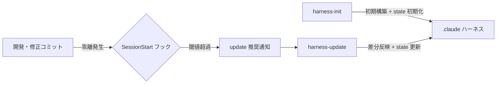

# 同期仕様（SSOT）

開発・修正で生じた変更を `.claude` ハーネスへ随時反映するための状態管理・差分検出・鮮度検知の仕様。
`harness-init`（初期化）・`harness-update`（差分反映）・SessionStart フック（鮮度検知）はこの仕様に従う。

## 1. .sync-state.json

配置: `<target-repo>/.claude/references/.sync-state.json`（git 管理対象。チームで同期状態を共有する）

```json
{
  "last_synced_commit": "<full-sha>",
  "last_synced_at": "<ISO 8601>",
  "initialized_at": "<ISO 8601>",
  "threshold_commits": 10
}
```

| フィールド | 内容 |
|-----------|------|
| `last_synced_commit` | 最後にハーネスへ反映済みのコミット SHA（full）。`harness-init` 完了時と `harness-update` 完了時に HEAD で更新 |
| `last_synced_at` | 最終同期日時 |
| `initialized_at` | `harness-init` 実行日時（初期化以降変更しない） |
| `threshold_commits` | 鮮度検知フックが update 推奨を通知する乖離コミット数の閾値（既定 10。プロジェクトのコミット頻度に応じて手動調整可） |

## 2. 差分検出フロー（harness-update）

1. `.sync-state.json` から `last_synced_commit` を読む
2. `git diff --name-status <last_synced_commit>..HEAD` で変更ファイル一覧（A/M/D/R）を取得
3. `references/` 配下全ドキュメントの frontmatter `sources` グロブと変更ファイルをマッチング
4. 分類ごとに反映する:

| 分類 | 条件 | 動作 |
|------|------|------|
| 既存ドキュメント更新 | 変更ファイルが既存ドキュメントの `sources` にマッチ | 該当ドキュメントの記載と実装の乖離を確認し更新 |
| 新規ドキュメント候補 | どの `sources` にもマッチしない追加ファイル群（まとまった機能単位） | 新規 spec / system-design / flow 等の作成を提案 |
| ドキュメント整理候補 | `sources` の対象ソースが全削除された | 該当ドキュメントのアーカイブ・削除をユーザに提案（無確認削除禁止） |
| ハーネス直接編集 | 変更ファイルが `.claude/` 配下 | 反映不要（インデックス整合のみ確認） |

5. 影響を受けた各フォルダの `CLAUDE.md` インデックスをファイル実体と一致させる
6. 更新したドキュメントの frontmatter `updated` を更新する
7. `.sync-state.json` の `last_synced_commit` / `last_synced_at` を HEAD で更新する

### 未コミット変更の扱い

`git status` で未コミット変更を検出した場合、反映対象には含めず「未コミット変更が N 件あるため、コミット後に再実行すると反映される」旨を報告する（同期基準はコミット SHA のため、作業途中の状態を state に記録できない）。

## 3. 鮮度検知フック（SessionStart）

スクリプト: `${CLAUDE_PLUGIN_ROOT}/references/scripts/hooks/freshness_check.sh`

| ステップ | 動作 |
|---------|------|
| 1 | カレントディレクトリが git リポジトリでなければ何も出力せず終了 |
| 2 | `.claude/references/.sync-state.json` が無ければ何も出力せず終了（ハーネス未導入プロジェクトへは無干渉） |
| 3 | `git rev-list --count <last_synced_commit>..HEAD` で乖離コミット数を取得 |
| 4 | 乖離数 >= `threshold_commits` の場合のみ、additionalContext で `/project-harness:update` の実行推奨を通知 |

### 設計原則

- **フェイルオープン**: git 失敗・JSON 破損・SHA 不明（rebase 等で到達不能）でも exit 0 で素通りし、セッション開始をブロックしない
- **無干渉**: ハーネス未導入プロジェクトでは一切出力しない
- **軽量**: 外部依存なし（git + 標準コマンドのみ）。タイムアウト 15 秒

## 4. 同期の全体像


