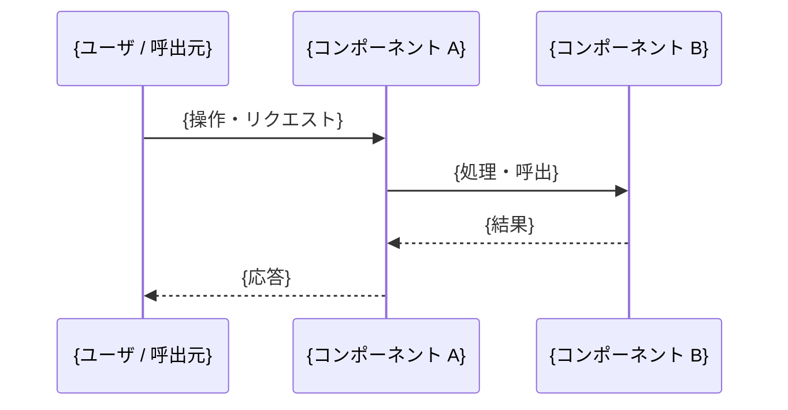

# {機能・画面名}詳細設計

対応仕様: [specs/{対応する仕様書}.md](../specs/{対応する仕様書}.md)

## 実装構成

| 責務 | ファイル | 概要 |
|------|---------|------|
| {例: 画面 / API / サービス / データアクセス} | `{ソースパス}` | {役割} |

## 処理フロー

{図の補足説明（各ステップの責務・同期 / 非同期・トランザクション境界）。図を解釈しない読者にも内容が伝わるよう文章でも記す}

## データ

該当しない行は削除する（永続化を伴わない機能では「永続化」行を削除）。

| 対象 | 内容 |
|------|------|
| 入力 | {入力データ・パラメータと型・制約} |
| 出力 | {出力データ・戻り値} |
| 永続化 | {対象テーブル・エンティティと操作（CRUD）} |

## 例外・エラー処理方針

確認できた例外処理がない場合は表を削除し、`TODO: 例外処理方針を要確認` と記す（「例外なし」と断定しない）。

| 発生箇所 | 例外・エラー | 処理 |
|---------|-------------|------|
| {箇所} | {例外種別} | {ハンドリング・ユーザへの見せ方} |

## 実装時の注意点

- {既存実装との整合・パフォーマンス・トランザクション境界など、実装で詳細化すべき情報}

## 未確認事項

- TODO: {確認できなかった設計情報}
